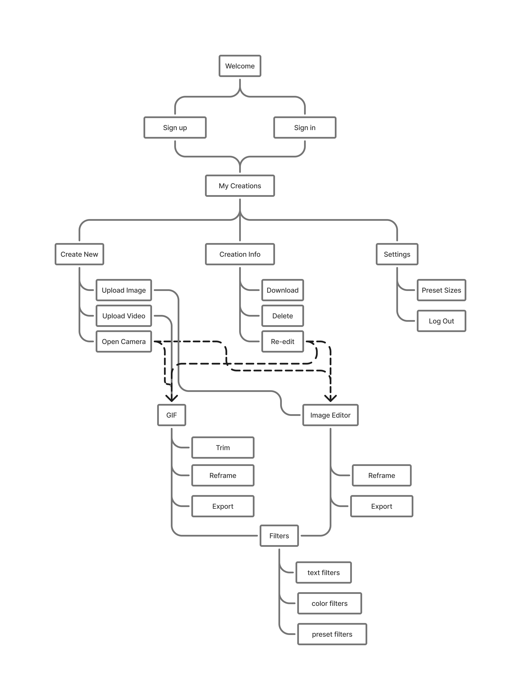
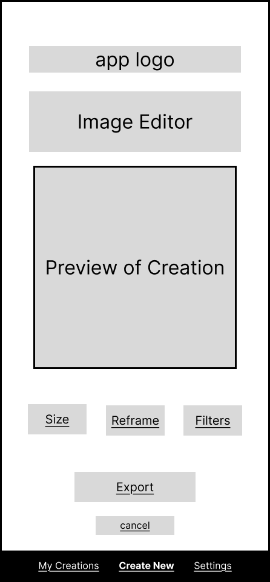
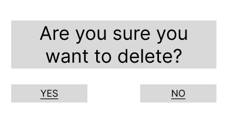

# User Experience Design

## App Map

## Wireframes

### Welcome Page

Main welcome page with options to log-in or create an account.

### Sign In or Sign Up

| Sign In | Sign Up |
|---|---|
|    Users with an existing account sign-in. |    Users without an existing account sign-up. |

---

### Create New

Start a new creation by selecting an input method (camera/upload) and choosing what to create (image or GIF).

---

### Editors

| GIF Editor | Image Editor |
|---|---|
|    Edit a GIF by previewing it and applying changes (ex: trim/resize) before saving. |   Edit an image into the correct sticker/emote format (resize/crop/adjust) before saving. |

---

### Delete Preview

Confirm deletion by showing the creation being removed and allowing the user to cancel or confirm.

### Preset Sizes

View options for preset sizes for the user to export their sticker to a specific platform.

---

### Color Filters

Add custom filters to a creation by adjusting brightness, contrast, saturation, and sharpness. 

