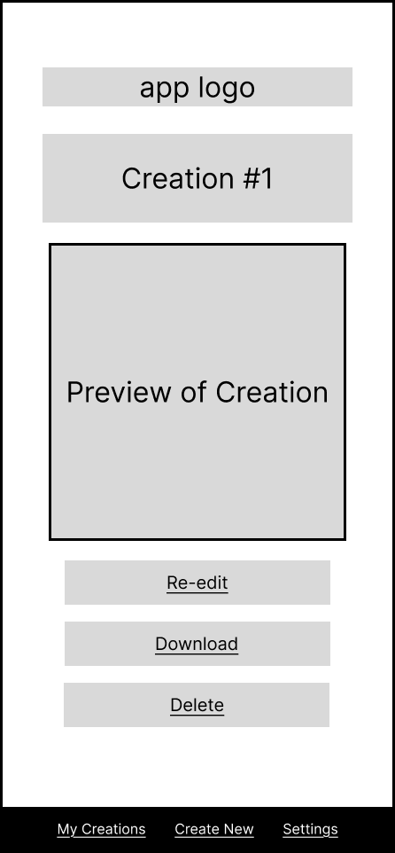
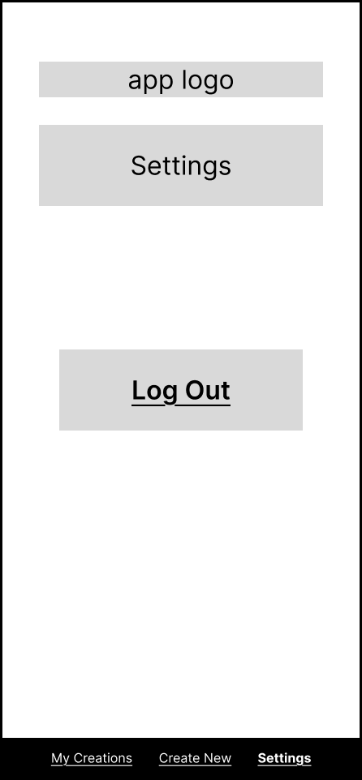

# User Experience Design

## Prototype

Access the app's clickable mobile prototype through this [Figma link](https://www.figma.com/proto/aboG9oKW0zIedQf6kyGbwP/team_stereroscopically?t=79OpV6aBKkcptjYG-1&scaling=scale-down&content-scaling=fixed&page-id=0%3A1&node-id=2-4&starting-point-node-id=2%3A4).

## App Map

## Wireframes

Access the wireframes through this [Figma link](https://www.figma.com/design/aboG9oKW0zIedQf6kyGbwP/team_stereroscopically?node-id=0-1&t=55bRTaUbjbtduchY-1).

### Welcome Page

Main welcome page with options to log-in or create an account.

### Sign In or Sign Up

| Sign In | Sign Up |
|---|---|
|    Users with an existing account sign-in. |    Users without an existing account sign-up. |

---

### Create New

Start a new creation by selecting an input method (camera/upload) and choosing what to create (image or GIF).

---

### Editors

| GIF Editor | Image Editor |
|---|---|
|    Edit a GIF by previewing it and applying changes (ex: trim/resize) before saving. |   Edit an image into the correct sticker/emote format (resize/crop/adjust) before saving. |

---
### Filter Main Screen 

Allows the user to choose between preset filters, adding text, or adjusting color filters to customize the creation. 

---
### Preset Filter Screen

Allows the user to preview and apply predefined filter styles to quickly customize the appearance of the creation. 

---

### Preset Sizes

Choose a given preset size for the user to export a sticker to a specific platform, or create a custom sticker size. 

### Color Filters

Apply custom filters to a creation by adjusting brightness, contrast, saturation, and sharpness. 

### Text Filters

Add and customize text on the creation by entering text and adjusting font, size, and positon. 

---

### My Creations (Empty)

Allows the user to make the first sticker if the My Creations is empty.

### My Creations (With Saved Creations)

This view appears when the user has saved creations—they can browse and tap their past creations to view or manage them.

### Detail

Opens when the user taps a saved creation. Shows a preview of the creation and provides options to re-edit, download, or delete it.

### Delete Preview

Confirm deletion by showing the creation being removed and allowing the user to cancel or confirm.

---

### Settings

Standard app settings screen, also includes a log out option.
